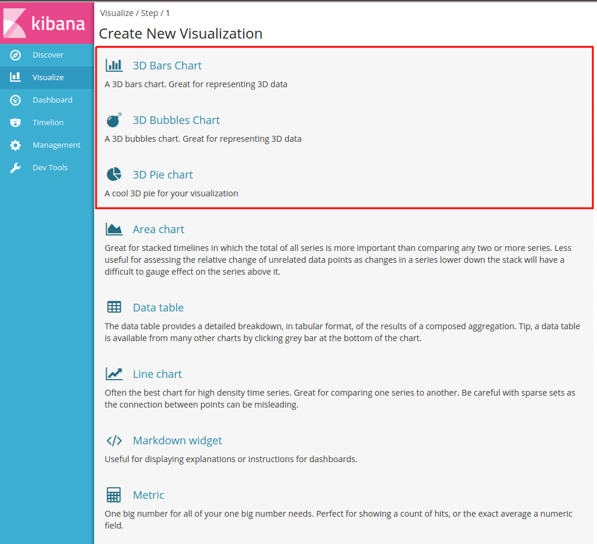
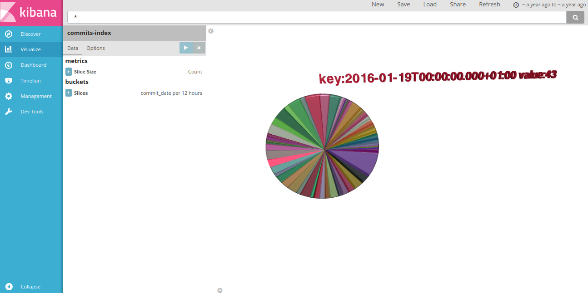
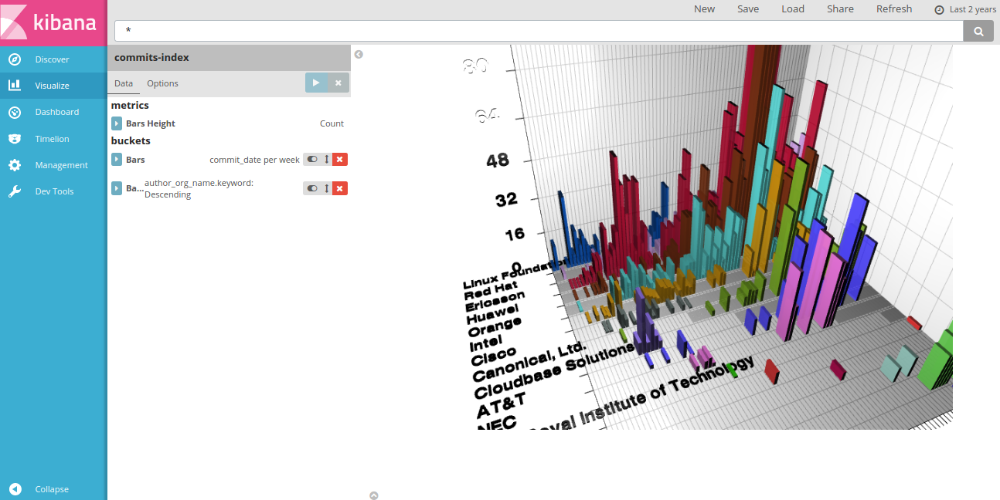

# 3D Visualizations for Kibana

3D pie chart, bars chart and bubbles chart visualizations for Kibana 5.
######Link to the page: https://virusu.github.io/3D_kibana_charts_vis/



##3D Pie Chart



##3D Bars Chart



##3D Bubbles Chart


##Installation steps:

```
cd KIBANA_HOME/plugins
git clone https://github.com/virusu/3D_kibana_charts_vis.git 3D_kibana_charts_vis
cd 3D_kibana_charts_vis
npm install
```

> **Important:** If you have any problem with the plugin version (like a warning message "**it expected Kibana version "x.x.x", and found "5.0.0"**") only change the value of the "version" tag on the package.json to your Kibana version

####Uninstall:
```
cd KIBANA_HOME
rm -rf plugins/network_vis/
```
